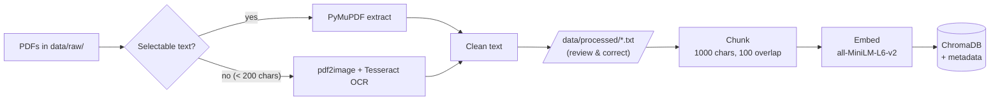
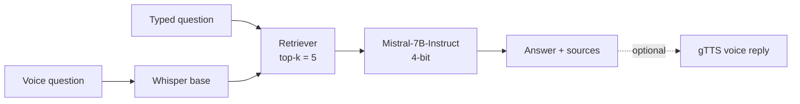

# AI Study Assistant

**Ask questions about your own notes and get answers grounded in them, using open-source models that run on your own GPU.**

<p align="center">
  
  
  
  
  
</p>

AI Study Assistant is a local, RAG-based study companion. You point it at your own PDFs (typed slides, research papers, even scanned handwritten notes). It indexes them into a vector database. It then answers your questions from that material and cites the passages it used. On top of Q&A it can summarize a topic, generate flashcards, quiz you with semantic grading, and remember which topics you keep getting wrong. You can type your questions or speak them.

<p align="center">
  
</p>

## Features

| Feature | What it does |
| --- | --- |
| **Chat with your notes** | Natural-language Q&A over your whole library. Each answer comes with an expandable list of the source chunks and their file paths. |
| **Typed or spoken questions** | Record a question with the mic button; Whisper transcribes it and it runs through the same pipeline as typed text. |
| **Voice replies** | Optional toggle that reads answers aloud. |
| **Topic summaries** | Pick a topic in the sidebar and get a structured summary (map-reduce over that topic's chunks). |
| **Flashcards** | Generates question/answer cards for a topic, shown as click-to-reveal expanders. |
| **Quiz mode** | Turns generated flashcards into a quiz. Your typed answer is graded by *meaning* (embedding cosine similarity), not exact wording. |
| **Weak-topic tracking** | Wrong quiz answers are logged to SQLite. "Analyze My Performance" lists the topics where you make the most mistakes. |
| **OCR ingestion** | PDFs with no selectable text (scans, handwriting) fall back to Tesseract OCR automatically. |

## How it works

**1. Ingestion: build the index once**



**2. Question answering: every time you ask**



Every chunk in the vector store is tagged with `specialization`, `course`, `notes_type` and `source`, all taken from its folder path. The sidebar's topic dropdown is built from the `course` tag. Summaries, flashcards and quizzes use it to pull every chunk of the chosen topic.

## Tech stack

| Layer | Technology |
| --- | --- |
| UI | Streamlit, `streamlit-mic-recorder` |
| Orchestration | LangChain (`RetrievalQA`, map-reduce summarize chain, prompt → LLM → parser chains) |
| Parsing / OCR | PyMuPDF, `pdf2image` + Tesseract |
| Embeddings | `sentence-transformers/all-MiniLM-L6-v2` |
| Vector DB | ChromaDB (persistent, metadata-filterable) |
| LLM | `mistralai/Mistral-7B-Instruct-v0.3`, 4-bit NF4 via `bitsandbytes` |
| Speech-to-text | `openai/whisper-base` (Hugging Face `transformers` pipeline) |
| Text-to-speech | gTTS |
| Memory | SQLite |

## Project structure

```
AI-Study-Assistant/
├── config.yaml                 # Paths, model names, chunking, k, quiz threshold
├── run_preprocessing.py        # Step 1: raw PDFs -> processed .txt
├── build_vector_store.py       # Step 2: .txt -> chunks -> embeddings -> ChromaDB
├── run_app.py                  # Step 3: launches the Streamlit app
├── run_pipeline.py             # Experimental: ask one question from the CLI
├── src/
│   ├── Preprocessing/          # document_parser.py (PyMuPDF + OCR), text_cleaner.py
│   ├── rag_core/               # chunker.py, embedder.py, retriever.py
│   ├── llm/                    # model_loader.py (4-bit Mistral as a LangChain LLM)
│   ├── features/               # generator (QA), summarizer, flashcard_generator, quiz_engine
│   ├── memory/                 # tracker.py (SQLite mistake log)
│   ├── voice/                  # speech_to_text.py, text_to_speech.py
│   └── app/                    # main.py (Streamlit UI)
├── tests/                      # pytest tests
└── data/                       # git-ignored: raw/, processed/, vector_store/, memory.db
```

## Requirements

- **Python 3.10+**
- **An NVIDIA GPU with CUDA.** 4-bit Mistral-7B needs roughly 6 GB+ of VRAM. The Whisper loader is also hard-coded to `device=0` (the first GPU). The project was developed on a Google Colab GPU runtime.
- **System packages** (Debian/Ubuntu):
  ```bash
  sudo apt install tesseract-ocr poppler-utils ffmpeg
  ```
  Tesseract does the OCR, Poppler is needed by `pdf2image`, and ffmpeg is used when Whisper decodes recorded audio.
- A free **Hugging Face account**. Mistral-7B-Instruct is a gated model.

## Installation

```bash
git clone https://github.com/ashpakshaikh26732/AI-Study-Assistant.git
cd AI-Study-Assistant

python -m venv venv
source venv/bin/activate            # Windows: venv\Scripts\activate

pip install -r requirements.txt
# The model/OCR/voice stack is not pinned in requirements.txt yet:
pip install torch transformers accelerate bitsandbytes pdf2image gTTS
```

Then authenticate with Hugging Face so the gated Mistral weights can download:

1. Accept the terms on the [Mistral-7B-Instruct-v0.3 model page](https://huggingface.co/mistralai/Mistral-7B-Instruct-v0.3).
2. Run `huggingface-cli login` and paste an access token.

## Usage

Run all commands from the repository root.

### 1. Add your notes

Put PDFs in `data/raw/` using **exactly three folder levels**:

```
data/raw/<Specialization>/<Course>/<NotesType>/<file>.pdf
```

```
data/raw/Deep Learning Specialization/Sequence Models/handwritten notes/notes.pdf
data/raw/Deep Learning Specialization/Sequence Models/lecture slides/week1.pdf
data/raw/Deep Learning Specialization/Sequence Models/related research papers/attention.pdf
```

The folder names become the metadata that drives the topic dropdown, so name them the way you want them to appear. `<Course>` is what shows up as the "topic".

### 2. Extract text

```bash
python run_preprocessing.py --config config.yaml
```

Each PDF is read with PyMuPDF. If that yields fewer than 200 characters, the script falls back to OCR. The cleaned text is written to `data/processed/` and mirrors the folder structure.

> **Recommended:** open the generated `.txt` files and fix them. OCR of handwriting is noisy, and cleaner text gives noticeably better retrieval. The vector store is built from whatever is in `data/processed/`, so your corrections are what gets indexed.

### 3. Build the vector store

```bash
python build_vector_store.py --config config.yaml
```

This chunks every `.txt` file in `data/processed/`, embeds the chunks, and saves them to ChromaDB at `data/vector_store/`. The first run downloads the embedding model.

> Re-running this script **appends** to the existing collection. If you change your notes, delete `data/vector_store/` first so you don't end up with duplicate chunks.

### 4. Launch the app

```bash
python run_app.py
```

This starts the Streamlit app at `http://localhost:8501`. The first launch is slow because it loads Mistral, Whisper and the embedding model. They are cached for the rest of the session.

## Using the app

- **Chat**: type in the box, or press 🎤 to speak and ⏹️ to stop. Open **Show Sources** under an answer to see exactly which chunks it was built from.
- **Study tools** (sidebar): choose a topic, then **Generate Summary**, **Generate Flashcards** or **Start Quiz**.
- **Quiz**: answer each question in your own words. An answer counts as correct when its similarity to the reference answer is ≥ 0.85. Wrong answers are logged with the topic and a timestamp.
- **Your Learning Profile**: **Analyze My Performance** shows the topics with the most logged mistakes.
- **Enable Voice Responses**: reads each chat answer aloud.

## Configuration

Everything lives in `config.yaml`:

| Key | Default | Meaning |
| --- | --- | --- |
| `data.raw_path` | `data/raw` | Where your source PDFs live |
| `data.processed_path` | `data/processed` | Where cleaned `.txt` files are written and read |
| `data.ocr_file_path` | `data/ocr_temp_images` | Scratch folder for OCR page images |
| `rag_core.chunking.chunk_size` / `chunk_overlap` | `1000` / `100` | Chunk length and overlap, in characters |
| `rag_core.embedding.model_name` | `sentence-transformers/all-MiniLM-L6-v2` | Embedding model (used for retrieval and quiz grading) |
| `rag_core.database.persist_directory` / `collection_name` | `data/vector_store` / `study_notes` | ChromaDB location and collection |
| `rag_core.retriever.k` | `5` | Chunks retrieved per question |
| `rag_core.generator.llm_name` | `mistralai/Mistral-7B-Instruct-v0.3` | Generative model |
| `features.quiz.similarity_threshold` | `0.85` | Minimum cosine similarity for a correct quiz answer |
| `memory.sqlite_database_path` / `limit` | `data/memory.db` / `3` | Mistake log location; how many weak topics to show |
| `voice.whisper_model` | `openai/whisper-base` | Speech-to-text model |

If you change the embedding model or the chunk settings, rebuild the vector store.

## Example dataset

The project was built and tested on a personal library of about 290 documents, roughly 5.9 million characters, which is about 6,500 chunks. It covers the Deep Learning, Machine Learning, NLP and TensorFlow specializations, a LangChain course, an ML-in-Production course, and medical-segmentation project papers. Every course has up to three kinds of material: handwritten notes, lecture slides and related research papers. Your data stays in the git-ignored `data/` folder and is never committed.

## Testing

```bash
pytest tests/
```

The suite covers the text cleaner, the SQLite mistake tracker and the semantic quiz grader. The quiz-grader test downloads the embedding model on first run. There are no tests for `rag_core` yet.

## Known limitations & roadmap

These are the main gaps I'd tackle next:

- [ ] **Topic-filtered chat.** Chat retrieval currently searches the whole library. The topic dropdown only scopes the summary, flashcard and quiz tools. Passing a ChromaDB metadata filter to the retriever is the natural fix.
- [ ] **Conversation memory and a grounding prompt.** Chat turns are independent, and the QA chain uses LangChain's default prompt with no explicit "I couldn't find this in your notes" behavior.
- [ ] **Context-window limits on large topics.** Flashcards and quizzes currently stuff *all* chunks of a topic into one prompt. Big topics should be sampled or processed in batches.
- [ ] **Incremental indexing.** Deterministic chunk IDs would make re-indexing idempotent instead of appending duplicates.
- [ ] **Consistent topic metadata.** Topics are derived from folder depth, so material stored in two-level folders gets mislabeled. Reading the hierarchy from the path relative to `data/raw` would be more robust.
- [ ] **Fully offline voice.** gTTS calls Google's service, so voice replies need internet. A local TTS (e.g. Piper) would keep everything on-device.
- [ ] **Easier setup.** Complete `requirements.txt`, remove the Colab-specific `sys.path` hack from the scripts, and add a CPU/API fallback for machines without a GPU.
- [ ] **Review My Mistakes quiz** and **spaced repetition** using the timestamps already stored in the mistake log.
- [ ] **Tables, diagrams and images** in notes.

## License

Released under the [MIT License](LICENSE).

## Author

**Ashpak Jabbar Shaikh**

[LinkedIn](https://www.linkedin.com/in/ashpak-shaikh-88a7372b0) · [GitHub](https://github.com/ashpakshaikh26732)
