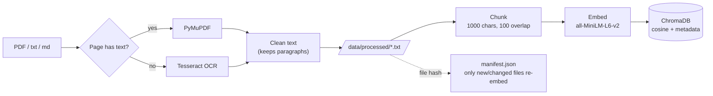
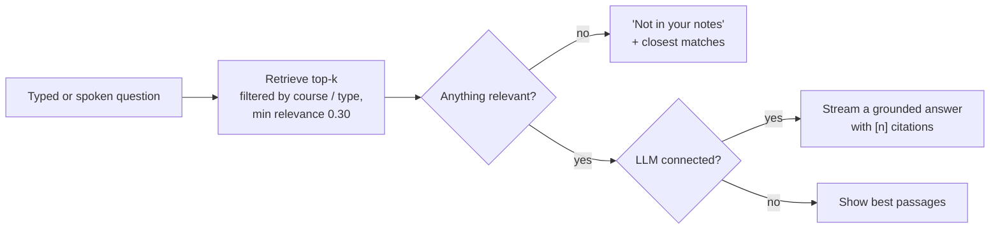

# AI Study Assistant

**Ask questions about your own notes and get answers grounded in them, using open-source models you run yourself. No GPU required.**

<p align="center">
  
  
  
  
  
</p>

AI Study Assistant is a local RAG (retrieval-augmented generation) study companion. Point it at your own PDFs, slides, papers or scanned handwritten notes. It indexes them, answers your questions from that material and cites the passages it used. On top of chat it can summarise a course, generate flashcards, quiz you with semantic grading, and track which topics you keep getting wrong.

It runs three ways: on a **laptop CPU** (with or without a local model), on a **free Colab GPU**, or against the **Gemini API**.

## Features

| | |
| --- | --- |
| **Chat with your notes** | Streamed answers with numbered citations `[1]`, plus expandable source cards showing the exact passages and how relevant each one was. |
| **Scope it** | Restrict a question to one course and/or note types (handwritten notes, slides, papers). The filter runs inside the vector DB. |
| **Works with no LLM** | Nothing installed for generation yet? Chat still returns the best-matching passages from your notes. |
| **Study tools** | Course summaries, a flip-card deck (CSV export for Anki), and a quiz graded by *meaning*, not exact wording. |
| **Review mistakes** | Re-quiz the questions you last got wrong. This needs no language model. |
| **Dashboard** | Library size and composition, quiz accuracy over time, weak topics, day streak. |
| **Library manager** | Upload notes in the browser; only new or changed files are re-indexed. |
| **Voice** | Ask by microphone (Whisper) and optionally hear answers read aloud (gTTS, needs internet). |
| **OCR** | Scanned pages inside a PDF are OCR'd page by page; typed pages are read directly. |

## Quick start (laptop, no GPU)

```bash
git clone https://github.com/ashpakshaikh26732/AI-Study-Assistant.git
cd AI-Study-Assistant
python -m venv .venv && source .venv/bin/activate      # Windows: .venv\Scripts\activate
pip install -r requirements.txt
```

**1. Add notes and build the index**

```bash
# Put PDFs (or .txt/.md) in data/raw/<Specialization>/<Course>/<NotesType>/
python run_preprocessing.py      # PDFs -> cleaned text in data/processed/
python build_vector_store.py     # text -> embeddings -> ChromaDB
```

Prefer clicking? Skip both commands, start the app and use **Library → Add notes**.

**2. Start the app**

```bash
python run_app.py                # http://localhost:8501
```

**3. (Recommended) connect a language model**

Without one, chat shows the best-matching passages. For real answers on CPU, install [Ollama](https://ollama.com) and pull a small model:

```bash
ollama pull llama3.2:3b          # ~2 GB, runs on CPU
```

Reload the app: the sidebar pill switches from *Retrieval-only* to *ollama · llama3.2:3b*. Prefer a cloud model? See [Language model backends](#language-model-backends).

> **Optional:** `sudo apt install tesseract-ocr` enables OCR for scanned/handwritten PDFs.

## Run on Google Colab (GPU)

Open [`notebooks/colab_run.ipynb`](notebooks/colab_run.ipynb) in Colab, set **Runtime → Change runtime type → T4 GPU**, and *Run all*. It clones the code, installs dependencies, reads your notes from Google Drive, builds the index (a few seconds on a GPU) and prints a public link to the app. The index is backed up to Drive so later sessions skip the rebuild, and your quiz history is saved to Drive too.

## How it works

**Ingestion: incremental and resumable**



**Answering a question**



Every chunk is tagged with `specialization`, `course`, `notes_type`, `source` and `chunk_index` from its folder path. The sidebar scope, the Study tools and the Dashboard all use those tags.

## Language model backends

Set `llm.provider` in `config.yaml` (or pick one in the sidebar → Settings).

| Provider | Where it runs | Needs | Notes |
| --- | --- | --- | --- |
| `auto` *(default)* | - | - | GPU model if CUDA is present, else a running Ollama, else retrieval-only. It never picks a cloud API on its own. |
| `ollama` | Your CPU/GPU, fully local | [Ollama](https://ollama.com) + a pulled model | Default model `llama3.2:3b`; change `llm.ollama.model`. |
| `gemini` | Google's servers | `GOOGLE_API_KEY` env var | Fast, no downloads. **Retrieved passages are sent to Google.** |
| `transformers` | NVIDIA GPU (e.g. Colab) | `requirements-gpu.txt`, Hugging Face login | 4-bit `Mistral-7B-Instruct-v0.3`, gated model. |
| `none` | - | - | Retrieval-only. |

## Data layout

```
data/raw/<Specialization>/<Course>/<NotesType>/<file>.pdf
data/raw/Deep Learning Specialization/Sequence Models/handwritten notes/notes.pdf
data/raw/Deep Learning Specialization/Sequence Models/lecture slides/week1.pdf
data/raw/Deep Learning Specialization/Sequence Models/related research papers/attention.pdf
```

Three folder levels give full metadata. Two levels are read as `<Course>/<NotesType>`, and one as `<Course>`. The **Course** is what appears as the topic in the sidebar. The `data/` folder is git-ignored, so your notes are never committed.

## Configuration

Defaults live in `config.yaml`. **Don't edit it for personal setups.** Create a `config.local.yaml` (git-ignored) containing only the keys you want to change:

```yaml
# config.local.yaml
data:
  processed_path: data/processed_new
llm:
  provider: ollama
  ollama:
    model: qwen2.5:3b
```

| Key | Default | Meaning |
| --- | --- | --- |
| `rag_core.chunking.chunk_size` / `chunk_overlap` | `1000` / `100` | Chunk length and overlap (characters). Changing this triggers an automatic rebuild. |
| `rag_core.embedding.model_name` | `all-MiniLM-L6-v2` | Embedding model (also used to grade quizzes). Changing it triggers a rebuild. |
| `rag_core.retriever.k` / `min_score` / `max_per_source` | `5` / `0.30` / `2` | Passages per answer, relevance cutoff, per-document cap. |
| `features.quiz.similarity_threshold` / `close_margin` | `0.85` / `0.15` | Similarity for "correct", and the "close" band below it. |
| `features.study.max_context_chunks` / `flashcards` | `8` / `8` | Passages sampled for summaries/flashcards; cards per set. |
| `ocr.enabled` / `dpi` | `true` / `200` | OCR for pages with no selectable text. |

Environment shortcuts (used by the Colab notebook): `STUDY_ASSISTANT_DATA_DIR`, `STUDY_ASSISTANT_INDEX_DIR`, `STUDY_ASSISTANT_LLM_PROVIDER`, `STUDY_ASSISTANT_CONFIG`.

## Performance

Measured on a 4-core laptop CPU with no GPU, on a library of 288 documents (about 7,600 passages):

| | |
| --- | --- |
| First index build | ~7.5 minutes (~15 passages/s). On a GPU this takes seconds. |
| Re-run with no changes | ~10 seconds (mostly loading libraries); nothing is re-embedded. |
| Adding one new note | Only that file is embedded. |
| Search | ~20 ms per question once the embedding model is loaded. |
| App start | ~8 seconds to the first page; the embedding model loads on your first question (~6 s more). |

The main speed-ups over the first version: incremental indexing, models loaded on first use instead of at startup, bounded prompts for summaries and flashcards (a sample of passages instead of the whole course), saved results, and streamed answers so text appears immediately.

## Project structure

```
AI-Study-Assistant/
├── config.yaml                  # defaults; personal overrides go in config.local.yaml
├── run_app.py                   # launch the web app
├── run_preprocessing.py         # raw PDFs -> processed text
├── build_vector_store.py        # processed text -> vector index (incremental)
├── run_pipeline.py              # ask one question from the terminal
├── notebooks/colab_run.ipynb    # one-click Colab runner
├── src/
│   ├── config.py                # layered config loading
│   ├── preprocessing/           # PDF/OCR extraction, text cleaning
│   ├── rag_core/                # chunker, embedder, vector store, incremental indexer, retriever
│   ├── llm/                     # pluggable backends: ollama / gemini / transformers / none
│   ├── features/                # grounded QA, summaries, flashcards, quiz grading, result cache
│   ├── memory/                  # SQLite: quiz attempts and mistakes
│   ├── voice/                   # Whisper speech-to-text, gTTS text-to-speech
│   └── app/                     # Streamlit app (views: chat, study, dashboard, library)
└── tests/                       # 90+ offline tests
```

## Testing

```bash
pytest                    # everything (the real-model test downloads MiniLM once)
pytest -m "not model"     # fully offline, ~15 s
```

The tests use a fake embedder and fake chat model, so they need no downloads, GPU or API keys.

## Troubleshooting

* **"Retrieval-only" in the sidebar:** no language model is connected. Install Ollama and `ollama pull llama3.2:3b`, or set up another backend (see above). Library → System shows exactly what's missing.
* **`Could not import module 'PreTrainedModel'` on startup:** an old system Pillow is being picked up. `pip install -U "pillow>=10"`.
* **Rebuilding the index:** it happens automatically when chunking or the embedding model changes. Force it with `python build_vector_store.py --rebuild`.
* **Scanned PDFs come out empty:** install Tesseract (`sudo apt install tesseract-ocr`) and re-run `python run_preprocessing.py --force`.

## Roadmap

- [ ] Page-level citations ("p. 12 of slides.pdf")
- [ ] Hybrid keyword + semantic search and a reranker
- [ ] Spaced repetition using the stored attempt history
- [ ] Tables, diagrams and images inside notes
- [ ] Fully local text-to-speech

## License

Released under the [MIT License](LICENSE).

## Author

**Ashpak Jabbar Shaikh**: [LinkedIn](https://www.linkedin.com/in/ashpak-shaikh-88a7372b0) · [GitHub](https://github.com/ashpakshaikh26732)
